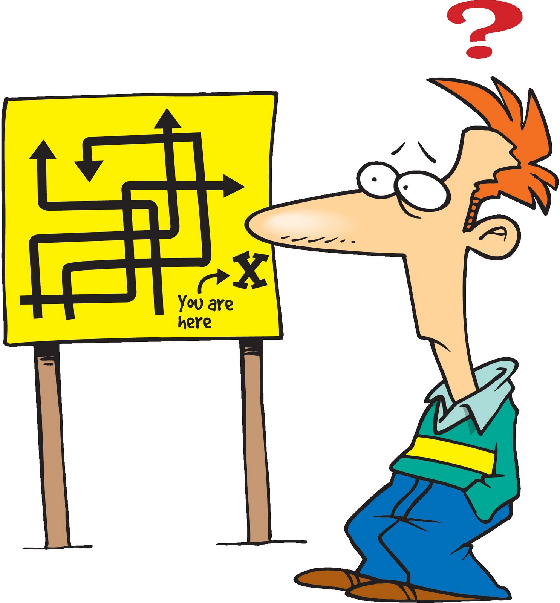

As a journalist, I ask questions on a daily basis. In fact, one of the pillars of journalism is asking questions and it's what keeps the business alive. I know I relate back to my journalism experiences quite a lot in these essays, but there's no doubt that more than a few aspects of journalism overlap with computer science. Like asking a good question, for example. Whether you’re posing questions to interviewees or to the internet, the heuristics of question-asking remain the same. 

What do I mean by a "good question"? I mean a question guided by the following principles: goal-orientation, precision, and mindfulness of the person on the recieving end of your question. Let's try to find an example of a question that embodies these traits in the wild.

## A Good Question 
I'll refer to StackOverflow for my examples. StackOverflow, for those not in the know, is a popular Q&A site for programmers to recieve and give help for various coding issues.

```
I have noticed that there doesn't appear to be a clear explanation of what the "this" keyword is<br/>
and how it is correctly (and incorrectly) used in JavaScript on the Stack Overflow site.
I have witnessed some very strange behaviour with it and have failed to understand why it has occurred.
How does "this" work and when should it be used?
```
Take <a href="https://stackoverflow.com/questions/3127429/how-does-the-this-keyword-work">this developer's question</a>, for example. He asks for clarification on the uses of the “this” keyword in Javascript. However, what distinguishes his question from the sea of other Javascript questions is that he has put effort into his post. He first starts off by stating he has a question that hasn't been addressed yet in StackOverflow, implying he has done his research prior to posting. Furthermore, the goal of the question, to learn what the "this" keyword is, is clear and concise. At the same time, the poster is humble and transparent about his misunderstandings.

Apparently, this question also resonated with many people. In fact, about 385k people have viewed this question at the time of this writing -- a testament to the fact that even if your question sounds basic, there's more likely than not another person with the same question in mind.

Now, this was a good example of how to ask questions on general computer science concepts. But how do we go about asking questions that are more specific to the individual?

<a href="https://stackoverflow.com/questions/750486/javascript-closure-inside-loops-simple-practical-example">This person</a> asking about Javascript closures does it well.

In this example, the asker clearly formats his code and his outputs, delineating each with a colored box. He explicitly compares what his code outputs and what it is supposed to output. He goes a step further and tries once more to find out what is wrong with his code by implementing different methods to find the source of his errors. And only after this does he go to the internet for help. What an upstanding poster!

The responses to this question is indicative of the success of the asker's post. The 40+ responses from various developers were complete with breakdowns of the the code, suggestions, diagrams and example code. Our asker must have done something write if he was able to generate this much response from strangers who have taken time out of their day to answer a very specific problem.

## How (not) to get your homework done by the internet

Now, on the flip side, what does a bad question look like? Well, it looks like this:
```
The function should return how many times the string contains one "B", one "A", two "L", two "O" and one "N".
e.g: BAONXXOLL returns 1. BAOOLLNNOLOLGBAX returns 2
```
<a href="https://stackoverflow.com/questions/57915252/javascript-from-a-string-i-want-to-know-how-many-times-one-b-one-a-two">This question</a> invited (deservedly) scathing answers. One poster even commented:
```
“What have you tried? What went wrong when you tried? Did you attempt to research anything to do with string manipulation? 
We can assist but generally we like it better if people show they have at least made some serious effort first. Thanks [sic]”
```
This is a suitable response to the poster's question because it sounds like the asker hasn't invested any effort into finding the solution himself. Rather, it just seems like someone trying to get the internet to do their homework for them. There are many areas where the original poster went wrong, but the most glaring issue is that his post makes no mention of the asker even attempting the solution before resorting to internet stragers for help. And as you can see above, the commentators definitely caught onto that.  

## So what’s the difference?

Looking at the difference between the quality of responses of both good and bad questions, one thing is certain: the thought you put towards your question comes back to you in the end. In the majority of cases, you can determine the success of your question by the quality of the responses. As I progress through my computer science career, I will strive to ask smart questions and remember to never take advantage of the generosity of the internet. 
