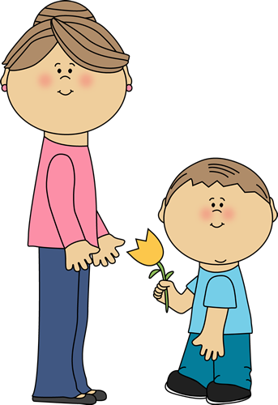

## Those who nag

ESLint reminds me of my mom. They have one thing in common: they are both notorious for nagging. Clean your room. Clean your code. You'd rather not do either of them or at least wait until tomorrow before getting started. Nevertheless, you do them anyways because "there are consequences for your actions" as my mom tells me -- whether that be a grounding or a poor grade. 

I'm sure they'd rather not bother us, but we're slovenly, uncleanly folk so it's up to them to do what's best for us, even if it means seeming like the enemy in our eyes. Admit it. You don't care about fixing that extra space in your code nor do you care about living in a clean room. No,you only care about getting that green checkmark and tricking your mom into thinking you actually cleaned your room.

One day, we'll realize that both ESLint and our mothers were right all along and why they've nagged us so much. The day we leave our mother's embrace and the day ICS 314 is over and we are no longer required to use ESLint, we'll realize it. Because we'll live in messy rooms filled with empty water bottles and we'll have code we don't remember how we put together.

## An intervention

But! This is an intervention! Hopefully, you won't have to get to that point. I can't tell you how to clean your room or how to get your mom to nag you less. But I can tell you about how and why ESLint is the greatest nag ever.

Have you ever done group programming? If so, you'll probably resonate with my current situation. In ICS 314, we do pair coding every Tuesdays in which we work with a randomly selected partner to solve a timed problem. Half of the time I've got to do a doubletake when I look at what they've written -- even if our implementations are the same. Perhaps they've done i = i + 1 rather than i++ or put their curly brace on a different lines. Well, whatever the case, even these simples changes can throw me off my game. When you've been coding solo for such a long time, it takes a while for you to adjust to a different coding style and all that it entails (different spacing, indentations, functions and variable names). 

Programmers, though we are stereotyped as antisocial hermits, work together quite a lot. In fact,most projects are collaborative. The nature of computer science requires it as no one person can fulfill multiple programming roles effectively. To make life easier for programmers, we've all got to follow an agreed upon coding standard -- so we don't have to take those extra precious seconds to understand our peers' code and vice versa.

Following coding standards doesn't just benefit your group members. You need to make life easier for yourself in any way you can. Sure, you may be able to remember what you did yesterday. But three days from now? A week later? 

Of all things that computer science is, it is information overload and the minutiae fades quickly. You'll thank yourself later when you come back to your code and can easily understand it. Your group members or the person who has inherited your code will also thank you for it.

The bottom line is: make life easier for yourself and others. Take five minutes and save yourself and others hours of trouble later. Following the coding standards does not have to be a monumental task. In fact, entire helper programs have been created to serve this purpose. This is where ESLint comes into play and why it is one of the most helpful tools a software developer can download.

## A PSA for all sons and daughters

By this point, I've sung all my praises for coding standards, though I'm sure there are yet more out there. So, if we can praise ESLint for this much nagging about our code, why can't we do the same for our mothers who aren't able to rely on programming to automatically correct us?

Dear reader, always remember to be thankful for the people (or programs) who keep you in line and make your life easier (even if you were unaware of it at the time). The next time you see your mom, give her a hug and some flowers. Thank her for all the times she's made the effort to nag you because it has allowed you to become the person you are today.