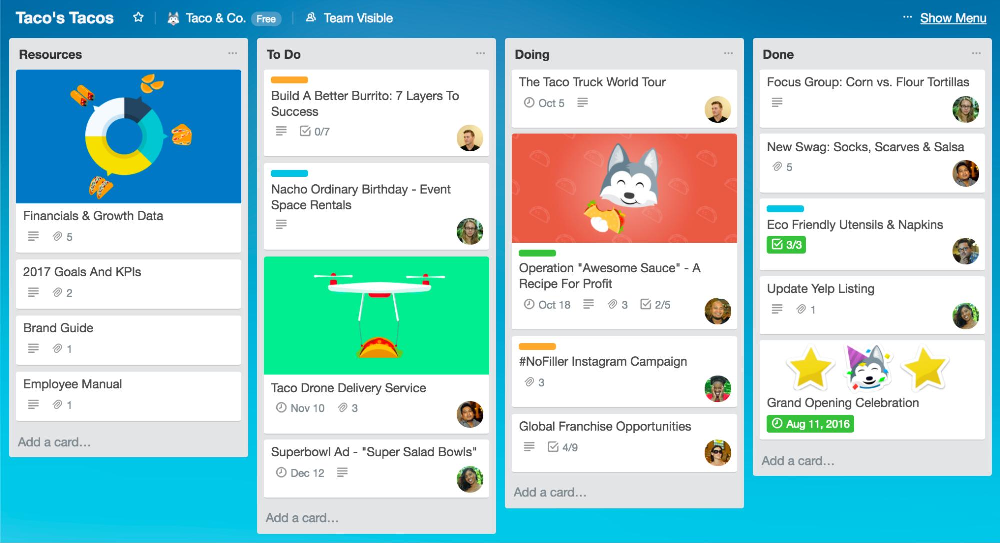

After spending several months in my first 300-level computer science course, it's safe to say that I'm no longer a new programmer. Of course, new is subjective, but it seems that with every semester, I learned exponentially more, refining my code and its efficiency in the process. Besides the obvious of having learned (or at least having practiced considering there is only so much a four-month-long course can cover) JavaScript, UI Frameworks, coding standards, and Agile project management, I learned many other things in the process that allowed me to mature as both a programmer and young adult.

## There is no shame in working in small incremement
 It is my nature to take on large projects and driven by a burst of passion, to work on them for extended amounts of time. I am a person who cannot see the forest for the trees and prefer to work on things until they are 100% done. If things are not 100% done, I feel unaccomplished. For example, for a final computer science project in which I built a [Metal Gear replica](https://jolieching.github.io/projects/metalgearsolid), I experienced my first college all-nighter. Several, in fact. The high investment did, however, return high rewards. But at what cost? After having stayed up a consecutive 48 hours to ensure my group's win, I was utterly burnt out. 

I tried to be more mindful of this tendency, especially for my sophomore year. With that being said, the issue-driven project management style hit home for me. For those unfamiliar with this project management style, it is essentially a method to divide a big project into manageable tasks. It made my life so much easier. Every time I closed an issue, I felt a sense of accomplishment that encouraged me to continue working on the project. At the same time, however, I also was able to work in more manageable and healthy intervals.

With that being said, I have also found an alternative to the GitHub milestone boards: an app called Trello. It employs the same issue-driven project management philosophy that I believe will help me navigate through a college student's many tasks.

## Know when to call it a day

This is perhaps one of the most important lessons that can be learned from any class. Poring over a single bug for more than three to four hours is neither helpful for you, your team members, or your sanity. In fact, it is quite harmful. It is human nature to lose interest in things that do not immediately or foreseeably produce desirable results (or perhaps this is only the product of a generation that has grown accustomed to instant gratification systems). Whether you are working by yourself or with a team, one of the most challenging obstacles in any project is to maintain a good morale. Otherwise, you'll get burned out and even dread working on the project. No programmer is exempt from this.

It is so important to take care of oneself and realize that one is not infallible to the consequences of burn out. This is where an effective Agile project management style can help save the day. At this point, I know sound like an advertisement but viewing project in terms of small tasks has revolutionized the way I view programming. For example, instead of saying "I'll finish the landing page by the end of this week," you can instead say "I'll finish implementing this button by today and this form by tomorrow." It is just so much more easier on your mental health and morale to view things in terms of what is accomplishable in a relatively short amount of time.

 